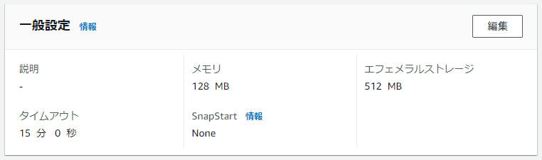
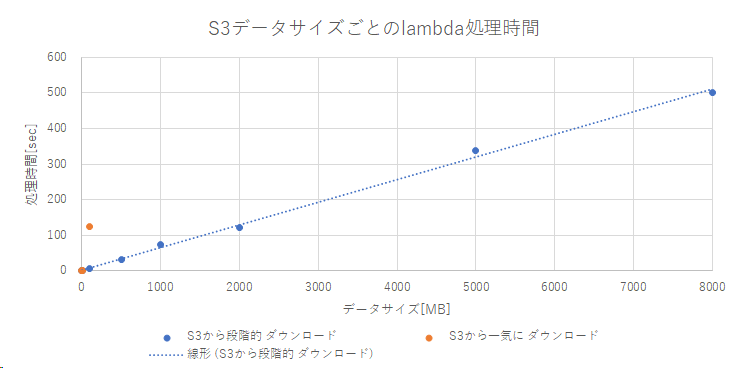
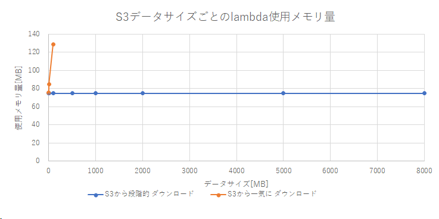

# s3-check-md5-for

Amazon S3 ファイルのMD5ハッシュ値を効率的に計算するLambdaのサンプルコードです。

# 前提条件

* python_version :  3.8.18
* boto3.version :  1.26.90

AWS Lambdaの基本的な設定は下記のとおりです。



# パフォーマンス計測結果

以下の2つの方式によるMD5ハッシュ値の算出パフォーマンスを計測して比較しました。

* 方式1：S3から少しずつダウンロードしながら計算する方式（使用済みデータは捨てる）
* 方式2：S3から一気に全てダウンロードして計算する方式（メモリ不足の懸念あり）

その結果【方式1】は、処理時間、使用メモリ量の両面において優れていることが確認できました。（下図）





# まとめ

S3に格納されたオブジェクトには巨大なものもあり得るため、特別な理由がない限りは、基本的には【方式1】のようにMD5ハッシュ値の計算を実装すべきと考えられます。

# Appendix.

## How to make big test data file in Windows

```
fsutil file createnew bigfile_001mb 1048576
fsutil file createnew bigfile_010mb 10485760
fsutil file createnew bigfile_100mb 104857600
fsutil file createnew bigfile_500mb 524288000
fsutil file createnew bigfile_01gb 1073741824
fsutil file createnew bigfile_02gb 2147483648
fsutil file createnew bigfile_05gb 5368709120
fsutil file createnew bigfile_08gb 8589934592
fsutil file createnew bigfile_10gb 10737418240
fsutil file createnew bigfile_20gb 21474836480
```
